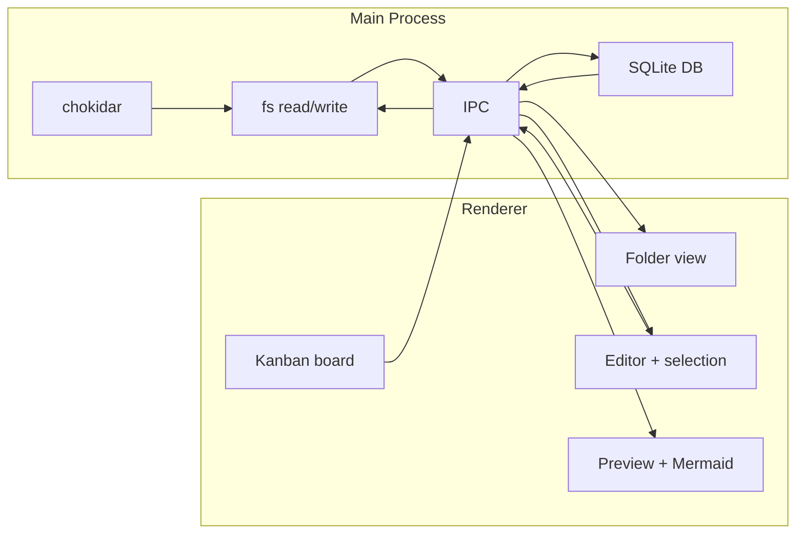

# MD Watch — Project Plan

## Overview

Build an Electron desktop app that:

- Previews local **Markdown** and **plain text** files with hot reload (no file locking)
- Renders **Mermaid** diagrams in Markdown
- Provides a **folder view** of .md/.txt files and subdirectories
- Restores **scroll position** on hot reload
- Drives a **bidirectional kanban** from user-selected text in the editor
- Persists **session** in a local SQLite database
- Supports **import/export** of session data as raw `.db` files
- **Tabs** for multiple open files (VS Code–style tab bar)
- **New file** creates a blank untitled tab; **Save / Save As** write to disk
- **Refresh** reloads the active file from disk, preserving kanban region and scroll
- **Kanban toggle** button and instruction modal with sample format
- **Logo** in header and as window/taskbar icon (Windows: multi-size .ico)
- **Hide editor / hide preview** toggles to show one panel full-width or both resizable
- **Dark and light theme** (selector in header; session-persisted; CSS variables; CodeMirror theme prop)
- **Keyboard shortcuts** for all major actions; **Help modal** (F1) lists them all
- **About & version**: About modal shows version, GitHub link, and update check
- **Auto-update check**: Queries GitHub Releases API; download button when newer version available
- **CI/CD**: GitHub Actions workflow (`release.yml`) builds and publishes releases on version tags

---

## Architecture

- **Electron**: Main process handles all file I/O and file watching; renderer is the UI (folder view, editor, preview, kanban).
- **File watching**: **chokidar** in the main process. On file change, main reads the file and sends content to the renderer via IPC. No exclusive file lock.
- **Session**: **SQLite** (e.g. better-sqlite3) in the main process. Export/import use the raw `.db` file.

---

## Phase 1: Previewer with hot reload, scroll persistence, folder view

- **1.1** Scaffold Electron app (electron-vite or Electron Forge + Vite), React UI. Preload exposes: `openFile`, `openFolder`, `listDirectory`, `readFile`, `watchFile`, `writeFile`, `getSession`, `setSession`, `exportSession`, `importSession`.
- **1.2** Open .md and .txt files (dialog filter), read without locking, watch with chokidar; on change send content to renderer.
- **1.3** Two panels: editor + preview. .md → Markdown (marked/markdown-it) to HTML; .txt → plain text (e.g. `white-space: pre-wrap`). Sync on load and on `file-changed`.
- **1.4** Save and restore preview scroll position on hot reload (e.g. ratio of scrollTop to scrollHeight).
- **1.5** In .md preview, detect fenced `mermaid` code blocks and render with the mermaid library; re-run on file change.
- **1.6** Folder view: `openFolder()` + `listDirectory(path)` (main). Renderer: tree of directories and .md/.txt files; click file to open and watch. Persist `lastOpenedFolder` in session.

---

## Phase 2: Kanban from selected text (bidirectional)

- **2.1** Editor exposes selection (CodeMirror 6). Store “kanban region” as `{ start, end }`. Convention: any heading level (`#`, `##`, `###`, …) = column; `-` / `*` list items = cards.
- **2.2** Parse selected range into columns/items; render kanban (e.g. @dnd-kit). On file or selection change, re-parse and update board.
- **2.3** On card drop: recompute markdown (move item between heading blocks), replace selected region in full content, call `writeFile`. Watcher then fires; re-sync and preserve scroll.
- **2.4** Handle invalid selection (e.g. file shortened externally); debounce chokidar events.

---

## Phase 3: Session (SQLite) and import/export

- **3.1** Main process: better-sqlite3 (or sql.js). Schema: e.g. key/value for `lastFilePath`, `lastOpenedFolder`, `previewScrollRatio`, kanban selection, `theme` (light/dark), etc. `getSession` / `setSession` read/write DB.
- **3.2** On app load: restore last opened file (if readable), last opened folder, scroll, and kanban selection; do not persist or restore folder tree expand/collapse state. On relevant user actions, call `setSession`.
- **3.3** Export: copy current .db to user-chosen path (e.g. session.db). Import: user picks .db; main merges keys from selected .db into current session DB (imported values override for same keys) and notifies renderer to reload session. Preload: `exportSession()`, `importSession()`; renderer shows success/error.

---

## Tech stack

| Concern     | Choice                         |
| ----------- | ------------------------------ |
| App shell   | Electron                       |
| Build       | electron-vite or Forge + Vite   |
| UI          | React (or Vue)                 |
| Markdown    | marked or markdown-it          |
| Mermaid     | mermaid (renderer)             |
| Editor      | CodeMirror 6                      |
| File watch  | chokidar (main)                |
| Session     | SQLite via better-sqlite3      |
| Kanban DnD  | @dnd-kit/core or similar       |

---

## File layout

- **main/** — Window, IPC, chokidar, fs, listDirectory, SQLite, import/export.
- **preload/** — contextBridge + ipcRenderer for file, folder, session, export/import.
- **src/** — React: App, FolderView, EditorPanel, PreviewPanel, KanbanBoard, hooks, import/export UI.

---

## UI / polish (implemented)

- **Logo**: MD-Li branding in app header; `assets/md-watch-logo.png` and `assets/md-watch-logo.ico` (Windows title bar and taskbar). Main process sets `BrowserWindow` `icon` from `assets/` (dev: app path; packaged: include in extraResources).
- **Hide editor / Hide preview**: Header checkboxes; when one is checked that panel is hidden and the other fills the main area; when both checked a placeholder is shown. No session persistence for these toggles.
- **Dark / light theme**: Header select (Light | Dark). CSS variables on `.app` define light defaults; `.app[data-theme="dark"]` overrides for dark (backgrounds, text, borders, preview, kanban, toasts). Session stores `theme`; restored on load. Editor: CodeMirror `theme` prop set to `'light'` or `'dark'` so the editor matches the app theme.

---

## Tabs, new file, save, refresh (implemented)

- **Tabs**: Multiple files can be open simultaneously. A VS Code–style tab bar shows all open tabs; click to switch, × to close. Session persists `openTabs` (array of `{ filePath, kanbanRegion }`) and `activeTabIndex`.
- **New file**: Header button + `Ctrl+N`. Creates a blank untitled tab with `filePath: null`. Typing and preview work immediately (defaults to markdown rendering). Save (`Ctrl+S`) prompts for a location; Save As (`Ctrl+Shift+S`) always prompts. After saving, the tab's `filePath` is set and file watching begins.
- **Save / Save As**: `Ctrl+S` saves to the existing file path, or prompts a save dialog for untitled files. `Ctrl+Shift+S` always prompts a save dialog. Both use the main-process `saveFileAs` IPC handler with `dialog.showSaveDialog`.
- **Refresh**: Header button + `Ctrl+R`. Re-reads the active file from disk, updates tab content, preserves the kanban region if still valid (clears if out of range), and restores the preview scroll position.
- **Close session**: Resets all state (tabs, folder, session DB) and opens a fresh blank untitled tab so the editor remains usable.

---

## Kanban toggle and instructions (implemented)

- **Kanban toggle**: Header button "Kanban" (`Ctrl+K`). The kanban section (board or instructions) is only visible when toggled on. Button highlights when active.
- **Kanban instruction modal**: When kanban is toggled on and no valid selection exists, an "Instructions" button opens a modal explaining how to use the kanban feature, with a copyable sample markdown format. Users can select the sample, copy it, paste into the editor, and select it to activate the board.

---

## Keyboard shortcuts and Help (implemented)

- A single global keyboard handler in the renderer captures common shortcuts:

| Shortcut | Action |
| --- | --- |
| `Ctrl+N` | New file |
| `Ctrl+O` | Open file |
| `Ctrl+S` | Save |
| `Ctrl+Shift+S` | Save as |
| `Ctrl+R` | Refresh file from disk |
| `Ctrl+W` | Close current tab |
| `Ctrl+Tab` | Next tab |
| `Ctrl+Shift+Tab` | Previous tab |
| `Ctrl+K` | Toggle kanban panel |
| `F1` | Toggle help |

- **Help modal**: Header "Help" button or `F1`. Opens a styled modal listing all shortcuts in a table with `<kbd>` elements. Shares the modal overlay/card styling with the kanban instruction modal. Supports both light and dark themes.

---

## About, versioning, and auto-update (implemented)

- **Versioning**: App version sourced from `package.json` → `app.getVersion()` in Electron main process. Exposed to renderer via `getAppVersion` IPC handler.
- **About modal**: Header "About" button. Shows logo, version string, a GitHub link (opens in default browser via `shell.openExternal`), and a "Check for updates" button.
- **Check for updates**: Main process queries `https://api.github.com/repos/cyrilth/MD-Watch/releases/latest`. Compares `tag_name` (stripped `v` prefix) against local version using semver comparison. Returns `{ currentVersion, latestVersion, updateAvailable, downloadUrl }`. Renderer shows result in the About modal; if an update is available, a "Download latest" button opens the release page.
- **GitHub Actions CI/CD**: `.github/workflows/release.yml`. Triggered on `v*` tags. Matrix build for Windows (NSIS + zip), macOS (DMG + zip), and Linux (AppImage + deb). Uses `electron-builder` for packaging. Artifacts uploaded per platform, then combined into a single GitHub Release via `softprops/action-gh-release`.
- **Release workflow**: Bump `version` in `package.json` → commit → `git tag v<version>` → push tag → GitHub Actions builds and publishes release.

---

## Open / optional

- Folder view: lazy-load on expand; optional Refresh.
