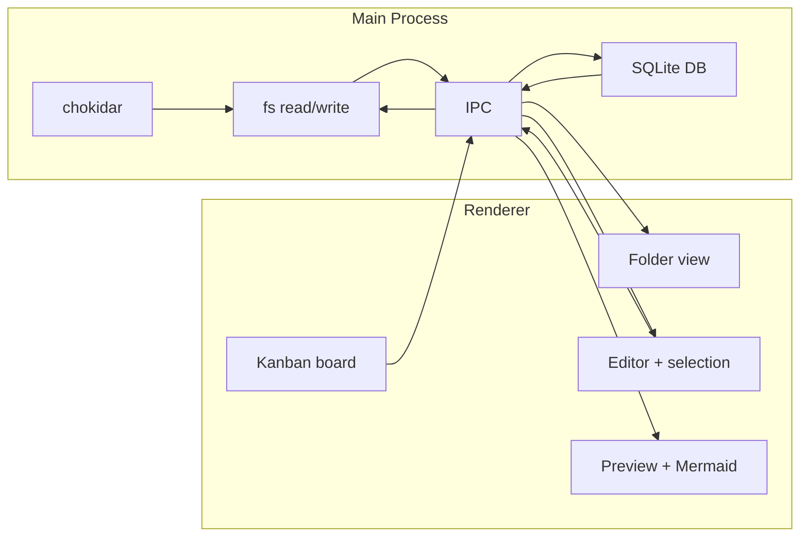

# MD Watch — Project Plan

## Overview

Build an Electron desktop app that:

- Previews local **Markdown** and **plain text** files with hot reload (no file locking)
- Renders **Mermaid** diagrams in Markdown
- Provides a **folder view** of .md/.txt files and subdirectories
- Restores **scroll position** on hot reload
- Drives a **bidirectional kanban** from user-selected text in the editor
- Persists **session** in a local SQLite database
- Supports **import/export** of session data as raw `.db` files

---

## Architecture

- **Electron**: Main process handles all file I/O and file watching; renderer is the UI (folder view, editor, preview, kanban).
- **File watching**: **chokidar** in the main process. On file change, main reads the file and sends content to the renderer via IPC. No exclusive file lock.
- **Session**: **SQLite** (e.g. better-sqlite3) in the main process. Export/import use the raw `.db` file.

---

## Phase 1: Previewer with hot reload, scroll persistence, folder view

- **1.1** Scaffold Electron app (electron-vite or Electron Forge + Vite), React UI. Preload exposes: `openFile`, `openFolder`, `listDirectory`, `readFile`, `watchFile`, `writeFile`, `getSession`, `setSession`, `exportSession`, `importSession`.
- **1.2** Open .md and .txt files (dialog filter), read without locking, watch with chokidar; on change send content to renderer.
- **1.3** Two panels: editor + preview. .md → Markdown (marked/markdown-it) to HTML; .txt → plain text (e.g. `white-space: pre-wrap`). Sync on load and on `file-changed`.
- **1.4** Save and restore preview scroll position on hot reload (e.g. ratio of scrollTop to scrollHeight).
- **1.5** In .md preview, detect fenced `mermaid` code blocks and render with the mermaid library; re-run on file change.
- **1.6** Folder view: `openFolder()` + `listDirectory(path)` (main). Renderer: tree of directories and .md/.txt files; click file to open and watch. Persist `lastOpenedFolder` in session.

---

## Phase 2: Kanban from selected text (bidirectional)

- **2.1** Editor exposes selection (CodeMirror 6). Store “kanban region” as `{ start, end }`. Convention: any heading level (`#`, `##`, `###`, …) = column; `-` / `*` list items = cards.
- **2.2** Parse selected range into columns/items; render kanban (e.g. @dnd-kit). On file or selection change, re-parse and update board.
- **2.3** On card drop: recompute markdown (move item between heading blocks), replace selected region in full content, call `writeFile`. Watcher then fires; re-sync and preserve scroll.
- **2.4** Handle invalid selection (e.g. file shortened externally); debounce chokidar events.

---

## Phase 3: Session (SQLite) and import/export

- **3.1** Main process: better-sqlite3 (or sql.js). Schema: e.g. key/value for `lastFilePath`, `lastOpenedFolder`, `previewScrollTop`, `previewScrollHeight`, kanban selection, etc. `getSession` / `setSession` read/write DB.
- **3.2** On app load: restore last opened file (if readable), last opened folder, scroll, and kanban selection; do not persist or restore folder tree expand/collapse state. On relevant user actions, call `setSession`.
- **3.3** Export: copy current .db to user-chosen path (e.g. session.db). Import: user picks .db; main merges keys from selected .db into current session DB (imported values override for same keys) and notifies renderer to reload session. Preload: `exportSession()`, `importSession()`; renderer shows success/error.

---

## Tech stack

| Concern     | Choice                         |
| ----------- | ------------------------------ |
| App shell   | Electron                       |
| Build       | electron-vite or Forge + Vite   |
| UI          | React (or Vue)                 |
| Markdown    | marked or markdown-it          |
| Mermaid     | mermaid (renderer)             |
| Editor      | CodeMirror 6                      |
| File watch  | chokidar (main)                |
| Session     | SQLite via better-sqlite3      |
| Kanban DnD  | @dnd-kit/core or similar       |

---

## File layout

- **main/** — Window, IPC, chokidar, fs, listDirectory, SQLite, import/export.
- **preload/** — contextBridge + ipcRenderer for file, folder, session, export/import.
- **src/** — React: App, FolderView, EditorPanel, PreviewPanel, KanbanBoard, hooks, import/export UI.

---

## Open / optional

- Folder view: lazy-load on expand; optional Refresh.
